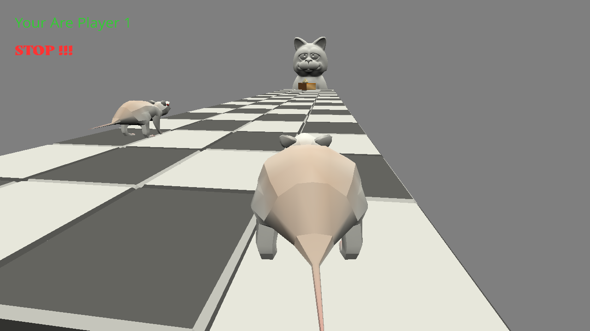

# Mice Game

### Author: Wenxuan(Neal) Huang, Chunan(Oscar) Huang

### Design: 
You need to be the first rat to reach the cake to win the game. However, the cat will turn around from time to time and moving while the cat is watching you or fall off theedge will reset you to the start point. You can also hit other rats to make them fall or cought by the cat.

### Networking:  
The network related codes are in the main function of Server.cpp and the update function of Playmode.cpp.  
The client handles player's inputs and translates them into infos like position, rotation, and velocity. And then the client will send these infos to the server.  
The server takes all players'(clients') infos and updates the game state as well as handles interactions between players.  
We also use several Unions (in Unions.hpp) to help on transitting messages that are larger then a byte, so that conversions between any data type (like vec3) and bytes can be easily done.

### Screen Shot:

### How To Play:

WASD to move and mouse motion to change the viewport.
You need to be the first rat to reach the cake to win the game. However, moving while the cat is watching you or fall off the
edge will reset you to the start point. You can also hit other rats to make them fall or cought by the cat.

### Sources: 
(TODO: list a source URL for any assets you did not create yourself. Make sure you have a license for the asset.)
#### Fonts
https://www.fontspace.com/open-sans-font-f22353  
https://www.fontspace.com/serat-font-f57208

#### 3d models
Cat Model https://free3d.com/3d-model/cat-v1--220685.html
rat model from garden.blend -- Yixin He
stage model from sphere-roller.blend -- Jim McCann

#### Sounds
Cat-Meow https://freesound.org/people/tuberatanka/sounds/110011/download/110011__tuberatanka__cat-meow.wav

This game was built with [NEST](NEST.md).

